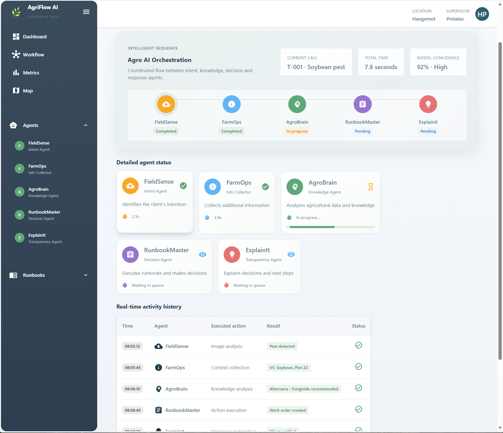

# Agro Auto-Resolve Frontend 

This is a modern React frontend (Vite + Material-UI) with mock data for the challenge **"Auto-resolve Service Desk for Agribusiness and Agriculture"**.

## 🚀 Features

* **Main Dashboard**: Ticket list with agents, runbooks, and interactive details.
* **Chat Simulation**: Mock conversations based on the challenge examples (WhatsApp/Teams style).
* **Metrics Dashboard**: KPIs such as ticket reduction, response time, accuracy, symptom ranking.
* **Field Plot Map**: Interactive Leaflet map showing plots with markers and popups (active alerts).
* **Full Transparency**: Step-by-step logs for each agent in each ticket.
* **Navigation**: React Router with multiple pages.

## 🧠 Demonstrated Agents

* **FieldSense** (Intent): Classifies user requests.
* **FarmOps** (Info Collector): Gathers missing information.
* **AgroBrain** (Knowledge): Queries knowledge bases.
* **RunbookMaster** (Decision): Chooses automation or escalation.
* **ExplainIt** (Transparency): Explains each step taken.

## ⚙️ Mock Runbooks

* **RB-01**: Generate pest report (Safe).
* **RB-02**: Open urgent work order (Critical).
* **RB-03**: Inventory check (Safe).
* **RB-04**: Pre-fill ART report (Critical).

## 📊 Mock Metrics

* Ticket reduction: **65%**
* Average resolution time: **12 minutes**
* Classification accuracy: **92%**
* Escalated: **8%**

## 🗺️ Field Plot Map

* Integrated with Leaflet (OpenStreetMap tiles).
* Markers for each plot with popups showing ID, crop, and status.
* Visual alerts: Normal (green), Pest/Maintenance (yellow/red).
* Ready for integration with GPS or weather APIs.

## 💻 How to Run (PowerShell — Windows)

1. Enter folder:
   `cd e:\projects\HackathonMicrosoftNov2025\web-frontend`
2. Install:
   `npm install`
3. Development mode:
   `npm run dev` (opens [http://localhost:5173](http://localhost:5173))
4. Build:
   `npm run build && npm run preview`

## 🎨 Design

* Material-UI theme with agricultural-green tones.
* Responsive layout with a side Drawer.
* Cards, Chips, and Progress Bars for rich visualization.

## 🔧 Suggested Next Steps

* Integrate real APIs (telemetry, ERP, weather).
* Add authentication (roles: operator, agronomist, admin).
* Upload real images for diagnostics.
* Push notifications for alerts.
* Integrate WhatsApp API for real chat automation.
* Persistence with backend (Node.js/Express or Azure Functions).
* Improve map: clusters, pest heatmaps, IoT sensor integration.

## 📁 Structure

* `src/App.jsx`: Routes and theme.
* `src/components/`: Dashboard, Chat, Metrics, MapView, TicketCard.
* `src/mockData.js`: Mock data (tickets, agents, metrics, plots).
* `public/images/`: Placeholder images.

---

Powered by **React + Vite + Material-UI**.
A complete demo for the **Microsoft Hackathon Nov 2025 Challenge**.
